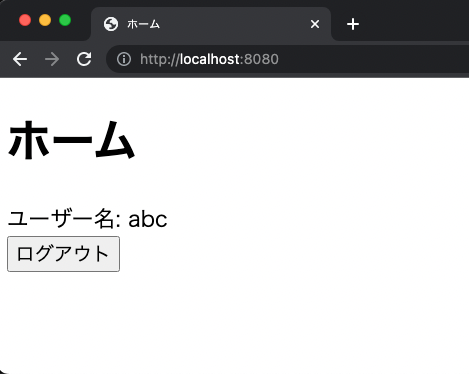

# channel-list
Develop a service to list and organize channels.

## Prepare Docker Container
```
# Starting Docker Container
$ docker-compose up -d

# Check Startup
$ docker ps -a

# Get into a Docker container
$ docker exec -it [CONTAINER ID] bash

# Connecting to mysql
$ mysql -h 127.0.0.1 -P 3306 -u root -p

# Create Database
mysql> create database channel_list;

# Go to Database
mysql> use channel_list;

# Add Table
mysql> source docker-entrypoint-initdb.d/create-tables.sql

# Check Table
mysql> show tables;

# Exit mysql
mysql> \q

# Exit From Container
$ exit
```

## Server startup

```
$ DBUSER=root DBPASS=root go run .
Check -> http://localhost:8080/
```

## Token Authentication

When a client signin, an token with an expiration time is generated.

### Security

- Save passwords as hashes
- Token generation by random numbers


### Home (Before signin)


### Signin


### Signup


### Home (After signup)
